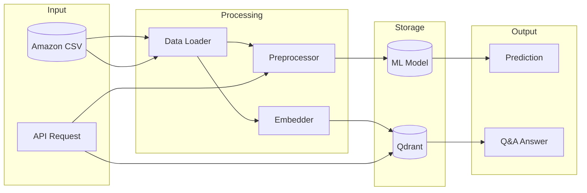
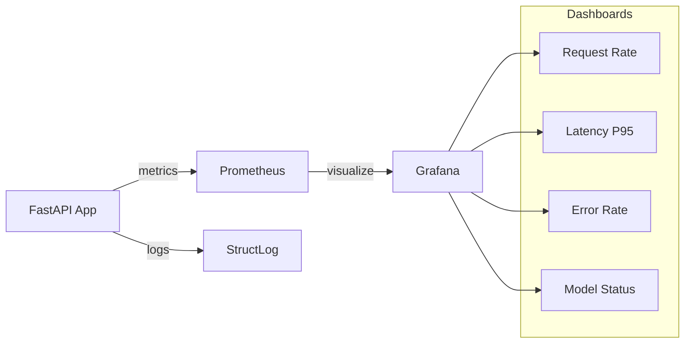
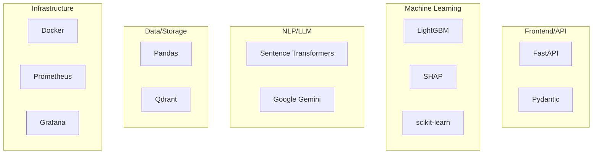

# Marketing Data Intelligence

An intelligent ML system for marketing data analysis featuring discount prediction and RAG-powered Q&A using Google's Gemini 2.0 Flash.

[](https://www.python.org/downloads/)
[](https://fastapi.tiangolo.com/)
[](https://opensource.org/licenses/MIT)

## Features

- **Discount Prediction**: LightGBM-based model predicting optimal discount percentages
- **RAG-Powered Q&A**: Semantic search with Qdrant + Gemini for product-related questions
- **SHAP Explainability**: Interpretable predictions with feature importance
- **Drift Detection**: Automated model monitoring and retraining triggers
- **Production-Ready**: Docker containerization, Prometheus metrics, Grafana dashboards

## Architecture

```mermaid
graph TB
    subgraph "Client Layer"
        Client[Client Applications]
    end
    
    subgraph "API Layer"
        FastAPI[FastAPI Application]
        subgraph "Endpoints"
            Predict[/predict_discount]
            QA[/answer_question]
            Analysis[/analysis/summary]
        end
    end
    
    subgraph "Core Services"
        subgraph "ML Engine"
            LightGBM[LightGBM Predictor]
            SHAP[SHAP Explainer]
            Drift[Drift Detector]
        end
        
        subgraph "RAG Engine"
            Embedder[Sentence Transformers]
            Retriever[Document Retriever]
        end
    end
    
    subgraph "External Services"
        Qdrant[(Qdrant Vector DB)]
        Gemini[Gemini 2.0 Flash]
    end
    
    subgraph "Monitoring"
        Prometheus[Prometheus]
        Grafana[Grafana]
    end
    
    Client --> FastAPI
    FastAPI --> Predict --> LightGBM
    FastAPI --> QA --> Retriever --> Qdrant
    Retriever --> Gemini
    LightGBM --> SHAP
    LightGBM --> Drift
    FastAPI --> Prometheus --> Grafana
```

## Data Flow



## Quick Start

### Prerequisites

- Python 3.11+
- Docker and Docker Compose
- Google Gemini API key

### Setup

1. **Clone and setup environment**:
   ```bash
   cd Marketing-Data-Intelligence
   cp .env.example .env
   # Edit .env and add your GEMINI_API_KEY
   ```

2. **Install dependencies**:
   ```bash
   uv sync --all-extras
   ```

3. **Prepare data**:
   Place your Amazon Sales Dataset CSV at `data/amazon.csv`
   
   Expected columns:
   - `product_name`, `category`, `actual_price`, `discounted_price`
   - `discount_percentage`, `rating`, `rating_count`
   - `about_product`, `review_content`

4. **Start services with Docker**:
   ```bash
   docker-compose up -d
   ```

5. **Train the model and index data**:
   ```bash
   # Train ML model (use sample data for testing)
   curl -X POST http://localhost:8000/predict/train \
     -H "Content-Type: application/json" \
     -d '{"use_sample_data": true}'
   
   # Index data for RAG
   curl -X POST http://localhost:8000/qa/index \
     -H "Content-Type: application/json" \
     -d '{"recreate_collection": true}'
   ```

### Local Development

```bash
# Activate virtual environment
source .venv/bin/activate

# Start Qdrant
docker run -p 6333:6333 qdrant/qdrant

# Run the API
python -m uvicorn src.main:app --reload
```

## API Endpoints

### Prediction

**POST /predict_discount** - Predict optimal discount percentage

```json
{
  "category": "Electronics",
  "actual_price": 999.99,
  "rating": 4.5,
  "rating_count": 1250
}
```

Response:
```json
{
  "predicted_discount": 23.5,
  "confidence": 0.85,
  "explanation": {
    "top_features": ["category", "rating_count", "actual_price"],
    "importance_scores": {"category": 0.35, "rating_count": 0.28}
  }
}
```

### Question Answering

**POST /answer_question** - Answer product-related questions

```json
{
  "question": "What are the best rated headphones under $100?",
  "filter_category": "Electronics",
  "filter_max_price": 100,
  "filter_min_rating": 4.0
}
```

Response:
```json
{
  "answer": "Based on our catalog, the top-rated headphones under $100 are...",
  "sources": [
    {"product": "Sony WH-CH520", "relevance": 0.92}
  ],
  "grounded": true
}
```

### Other Endpoints

- `GET /health` - System health check
- `GET /metrics` - Prometheus metrics
- `GET /predict/status` - ML model status
- `POST /predict/explain` - SHAP explanation for predictions
- `POST /qa/index` - Index data for RAG
- `GET /qa/search` - Semantic product search
- `GET /analysis/summary` - Dataset analysis

## Documentation

Comprehensive documentation is available in the `docs/` folder:

| Document | Description |
|----------|-------------|
| [Architecture Overview](docs/architecture/overview.md) | High-level system design with Mermaid diagrams |
| [ML Pipeline](docs/architecture/ml-pipeline.md) | Machine learning model architecture |
| [RAG System](docs/architecture/rag-system.md) | Retrieval-augmented generation details |
| [Data Flow](docs/architecture/data-flow.md) | Data processing pipelines |
| [API Reference](docs/api/endpoints.md) | Complete API documentation |
| [Development Setup](docs/development/setup.md) | Local development guide |
| [Testing Guide](docs/development/testing.md) | Testing strategy and examples |
| [Docker Deployment](docs/deployment/docker.md) | Container deployment guide |
| [Monitoring Guide](docs/deployment/monitoring.md) | Observability setup |

## Project Structure

```
Marketing-Data-Intelligence/
├── src/
│   ├── main.py              # FastAPI application
│   ├── config.py            # Settings management
│   ├── api/                  # API routes and schemas
│   ├── ml/                   # ML models (predictor, trainer, drift, explainer)
│   ├── rag/                  # RAG system (embedder, indexer, retriever)
│   ├── llm/                  # Gemini client and prompts
│   ├── data/                 # Data loading and preprocessing
│   ├── analysis/             # EDA module
│   └── observability/        # Metrics and logging
├── tests/
│   ├── unit/                 # Unit tests
│   ├── integration/          # Integration tests
│   └── load/                 # Load tests (Locust)
├── docs/                     # Documentation
│   ├── architecture/         # Architecture docs with Mermaid
│   ├── api/                  # API reference
│   ├── development/          # Development guides
│   └── deployment/           # Deployment guides
├── monitoring/               # Prometheus & Grafana config
├── docker-compose.yml
└── Dockerfile
```

## Testing

```bash
# Run unit tests
uv run pytest tests/unit -v

# Run integration tests
uv run pytest tests/integration -v

# Run all tests with coverage
uv run pytest --cov=src --cov-report=html

# Run load tests
uv run locust -f tests/load/locustfile.py --host=http://localhost:8000
```

## Monitoring



Start the monitoring stack:
```bash
docker-compose --profile monitoring up -d
```

- **Prometheus**: http://localhost:9090
- **Grafana**: http://localhost:3000 (admin/admin)

## Configuration

Environment variables (set in `.env`):

| Variable | Description | Default |
|----------|-------------|---------|
| `GEMINI_API_KEY` | Google Gemini API key | Required |
| `APP_ENV` | Environment (development/production) | development |
| `API_HOST` | API host | 0.0.0.0 |
| `API_PORT` | API port | 8000 |
| `QDRANT_HOST` | Qdrant host | localhost |
| `QDRANT_PORT` | Qdrant port | 6333 |
| `LOG_LEVEL` | Logging level | INFO |
| `DRIFT_THRESHOLD` | Drift detection threshold | 0.1 |

## Model Training

Train with real data:
```bash
python -m src.ml.trainer --data data/amazon.csv
```

Train with sample data (for testing):
```bash
python -m src.ml.trainer --sample
```

## Technology Stack



## Metrics

The system exposes Prometheus metrics:

- `http_requests_total` - Total HTTP requests by endpoint/status
- `prediction_requests_total` - Prediction requests by category
- `prediction_latency_seconds` - Prediction latency histogram
- `qa_requests_total` - Q&A requests by grounded status
- `qa_latency_seconds` - Q&A latency histogram
- `rag_results_count` - Number of RAG results per query
- `model_loaded` - ML model status gauge

## Contributing

1. Fork the repository
2. Create a feature branch (`git checkout -b feature/amazing-feature`)
3. Make your changes
4. Run tests (`uv run pytest`)
5. Commit your changes (`git commit -m 'Add amazing feature'`)
6. Push to the branch (`git push origin feature/amazing-feature`)
7. Open a Pull Request

## License

MIT License

## Acknowledgments

- [FastAPI](https://fastapi.tiangolo.com/) - Modern web framework
- [LightGBM](https://lightgbm.readthedocs.io/) - Gradient boosting framework
- [Qdrant](https://qdrant.tech/) - Vector database
- [Google Gemini](https://ai.google.dev/) - Large language model
- [SHAP](https://shap.readthedocs.io/) - Model explainability
