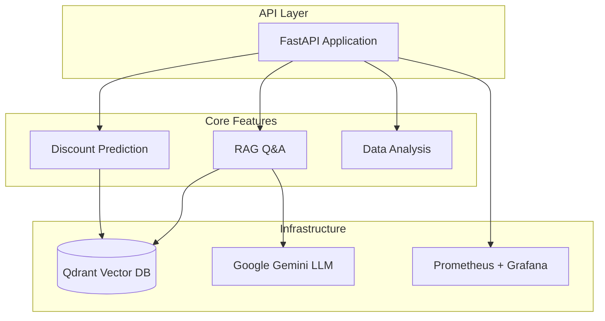

# Documentation Index

Welcome to the Marketing Data Intelligence documentation.

## Quick Navigation

### Architecture
- [System Overview](./architecture/overview.md) - High-level system architecture with diagrams
- [ML Pipeline](./architecture/ml-pipeline.md) - Machine learning model details
- [RAG System](./architecture/rag-system.md) - Retrieval-augmented generation architecture
- [Data Flow](./architecture/data-flow.md) - Data processing pipelines

### API
- [API Reference](./api/endpoints.md) - Complete API documentation with examples

### Development
- [Development Setup](./development/setup.md) - Environment setup guide
- [Testing Guide](./development/testing.md) - Testing strategy and examples

### Deployment
- [Docker Deployment](./deployment/docker.md) - Container deployment guide
- [Monitoring](./deployment/monitoring.md) - Observability and alerting

## System Overview

## Key Features

| Feature | Description | Documentation |
|---------|-------------|---------------|
| Discount Prediction | LightGBM-based prediction with SHAP explainability | [ML Pipeline](./architecture/ml-pipeline.md) |
| RAG Q&A | Semantic search with Gemini-powered answers | [RAG System](./architecture/rag-system.md) |
| Data Analysis | EDA and insights from marketing data | [Data Flow](./architecture/data-flow.md) |
| Monitoring | Prometheus metrics and Grafana dashboards | [Monitoring](./deployment/monitoring.md) |

## Getting Started

1. **New Developers**: Start with [Development Setup](./development/setup.md)
2. **API Users**: Check [API Reference](./api/endpoints.md)
3. **Deploying**: Follow [Docker Deployment](./deployment/docker.md)
4. **Understanding Architecture**: Read [System Overview](./architecture/overview.md)
