# Data Flow Architecture

This document describes how data flows through the Marketing Data Intelligence system.

## Overview

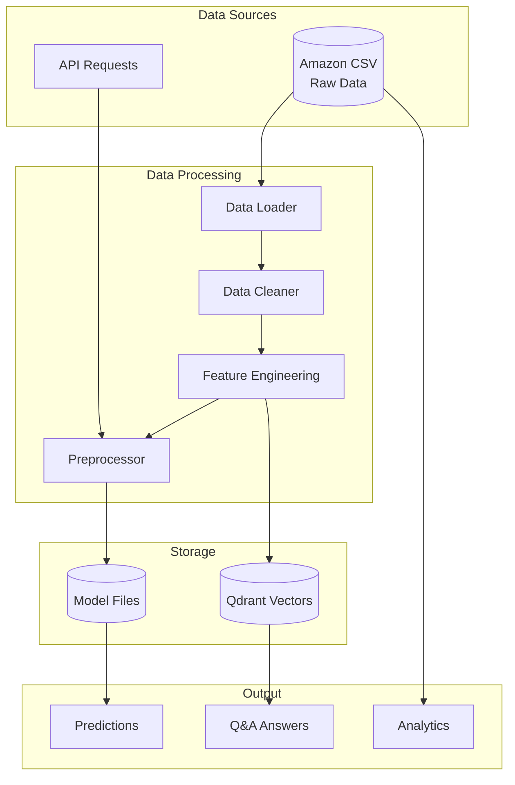

## Data Loading Pipeline

### CSV Processing Flow

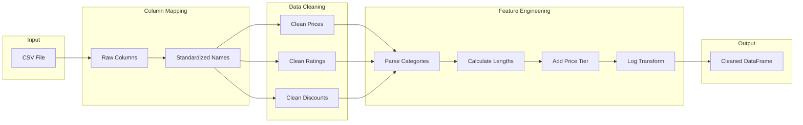

### Data Cleaning Functions

```mermaid
graph TB
    subgraph "Price Cleaning"
        PriceStr["₹1,299 or $99.99"]
        RemoveSym[Remove ₹ $ ,]
        ParseFloat[Parse to Float]
        PriceNum[1299.0 or 99.99]
    end
    
    subgraph "Rating Cleaning"
        RatingStr["4.5 out of 5 stars"]
        ExtractNum[Extract Numeric]
        RatingNum[4.5]
    end
    
    subgraph "Discount Cleaning"
        DiscountStr["50%"]
        ExtractPct[Extract Percentage]
        DiscountNum[50.0]
    end
    
    PriceStr --> RemoveSym --> ParseFloat --> PriceNum
    RatingStr --> ExtractNum --> RatingNum
    DiscountStr --> ExtractPct --> DiscountNum
```

### Column Mapping

| Original Column | Standardized Name | Description |
|-----------------|-------------------|-------------|
| `product_id`, `productid` | `product_id` | Unique identifier |
| `product_name`, `title` | `product_name` | Product name |
| `category`, `main_category` | `category` | Category hierarchy |
| `actual_price`, `price` | `actual_price` | Original price |
| `discount_percentage` | `discount_percentage` | Discount % |
| `rating`, `avg_rating` | `rating` | Average rating |
| `rating_count`, `num_ratings` | `rating_count` | Review count |

## Feature Engineering Pipeline

### Derived Features

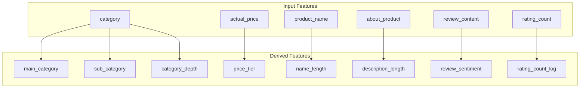

### Category Parsing

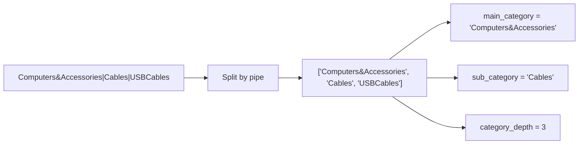

### Price Tier Classification

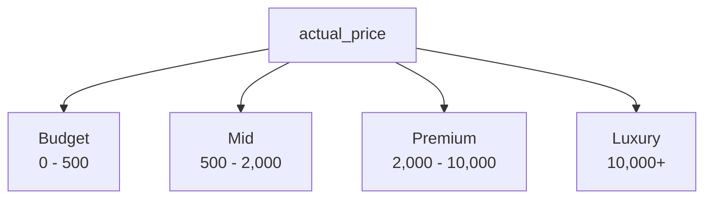

## ML Feature Preprocessing

### Preprocessing Pipeline

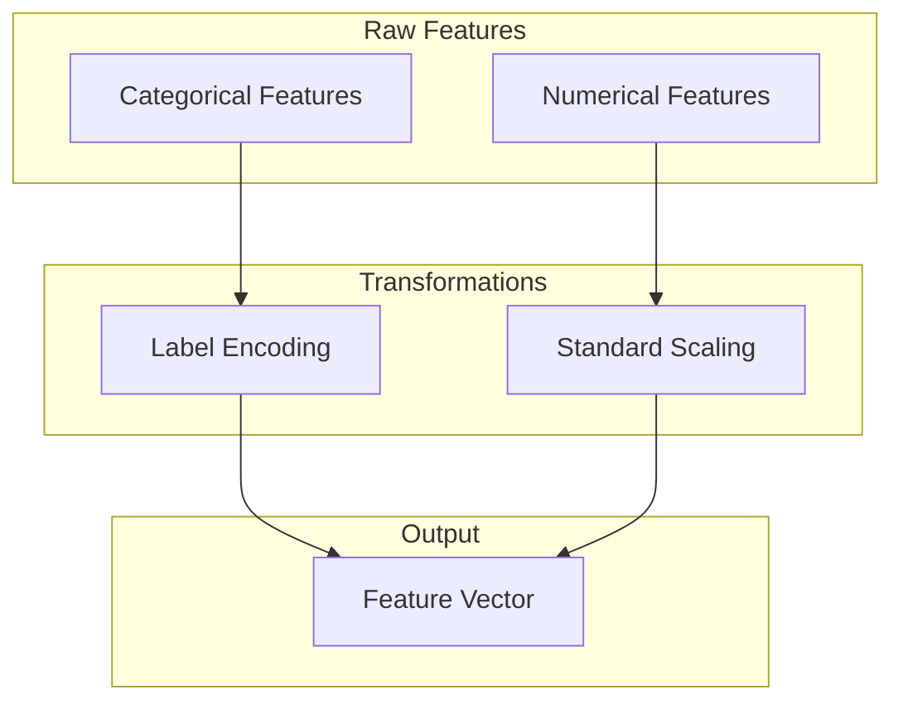

### Categorical Encoding

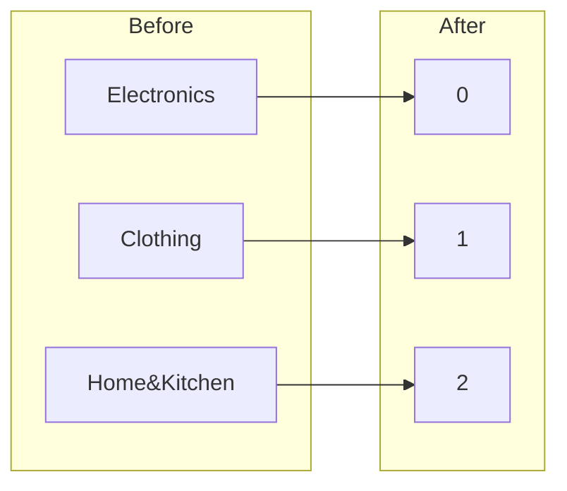

### Numerical Scaling

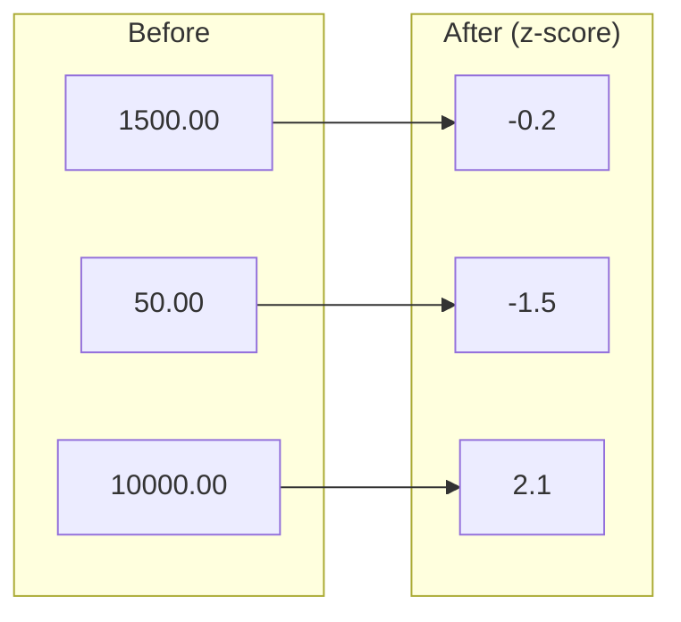

## RAG Document Preparation

### Document Construction

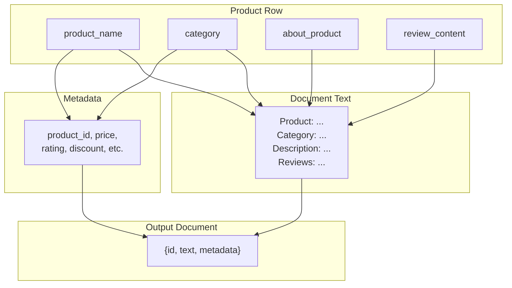

### Document Indexing Flow

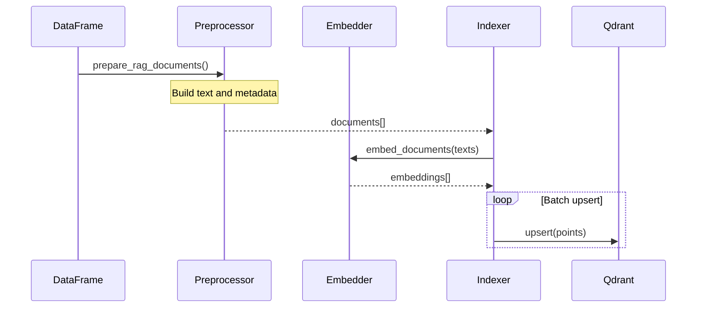

## Inference Data Flow

### Prediction Request Flow

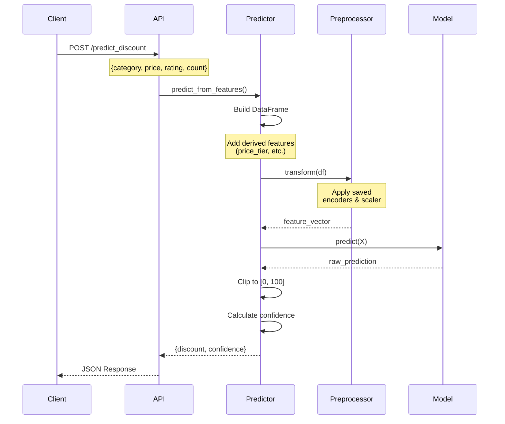

### Q&A Request Flow

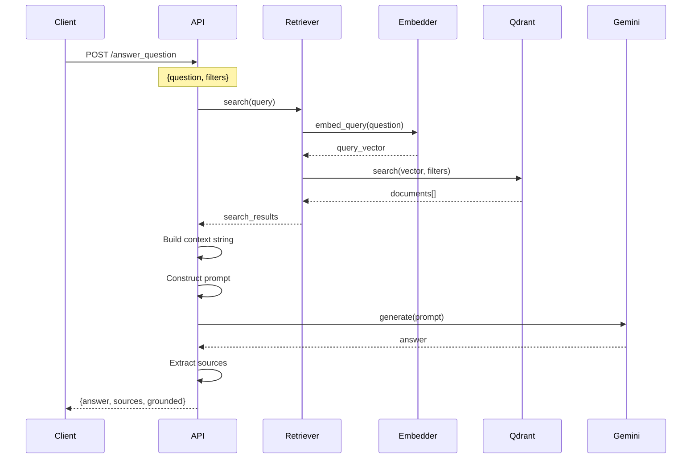

## Analytics Data Flow

### EDA Pipeline

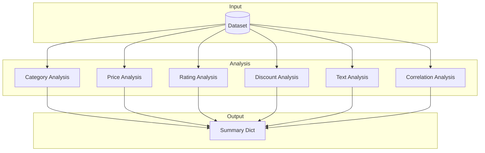

### Analysis Output Structure

```json
{
    "dataset_info": {
        "total_products": 10000,
        "total_features": 15
    },
    "categories": {
        "main_categories": {"unique_count": 10, "distribution": {...}},
        "sub_categories": {"unique_count": 50, "distribution": {...}}
    },
    "price_analysis": {
        "actual_price": {"min": 10, "max": 50000, "mean": 1500}
    },
    "rating_analysis": {
        "rating_stats": {"min": 1.0, "max": 5.0, "mean": 4.2}
    },
    "discount_analysis": {
        "discount_stats": {"min": 0, "max": 80, "mean": 25}
    },
    "correlations": {
        "correlations_with_discount": {...}
    }
}
```

## Data Validation

### Input Validation

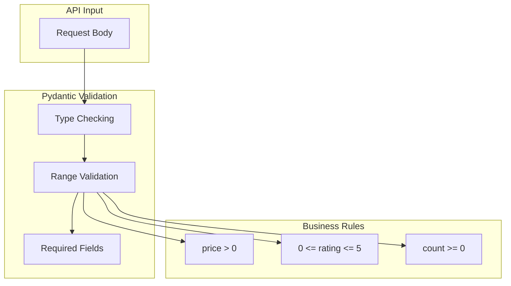

### Validation Rules

| Field | Type | Constraints |
|-------|------|-------------|
| `category` | string | Required |
| `actual_price` | float | > 0 |
| `rating` | float | 0-5 |
| `rating_count` | int | >= 0 |
| `question` | string | 3-1000 chars |

## Data Storage

### File System Structure

```
Marketing-Data-Intelligence/
├── data/
│   └── amazon.csv              # Raw dataset
├── models/
│   ├── discount_predictor.joblib    # Current model
│   └── discount_predictor_*.joblib  # Versioned models
└── logs/
    └── app.log                 # Application logs
```

### Docker Volumes

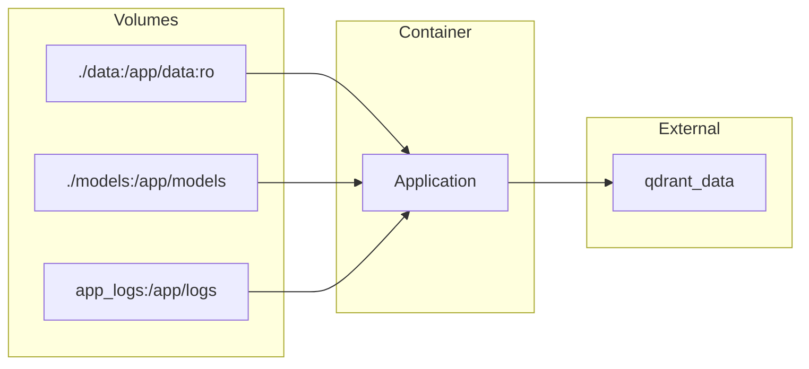

## Error Handling in Data Flow

### Error Points and Handling

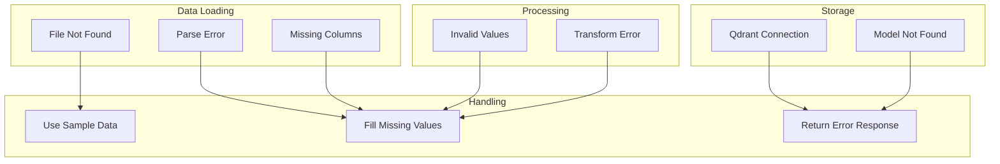

## Performance Considerations

### Bottlenecks and Solutions

| Operation | Bottleneck | Solution |
|-----------|------------|----------|
| Data Loading | Large CSV | Chunked reading |
| Feature Engineering | Sentiment Analysis | Batch processing |
| Embedding | Model inference | Batch embedding |
| Vector Search | Query latency | Index optimization |
| LLM Generation | API latency | Streaming responses |

### Caching Strategy

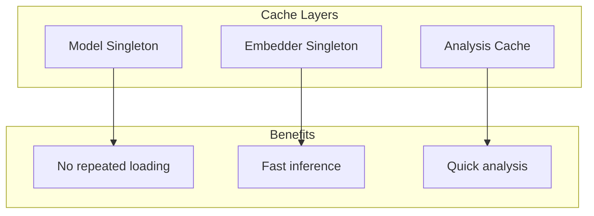

## Related Documentation

- [Architecture Overview](./overview.md) - System architecture
- [ML Pipeline](./ml-pipeline.md) - ML model details
- [RAG System](./rag-system.md) - RAG architecture
- [API Documentation](../api/endpoints.md) - API reference
