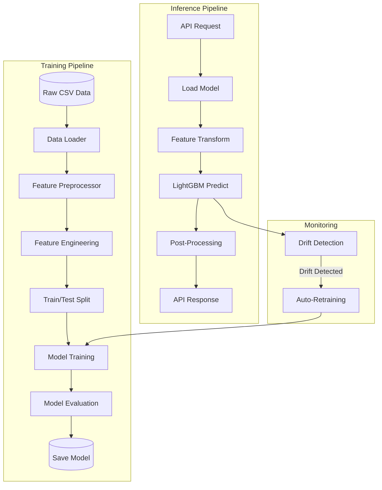
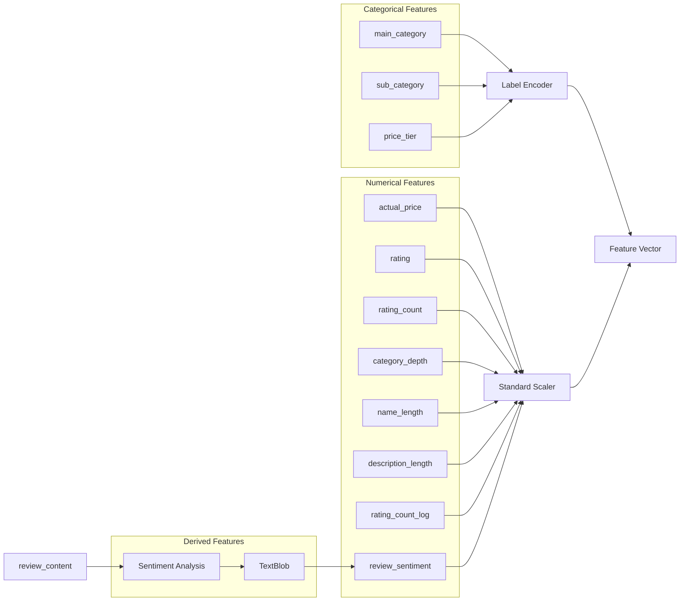
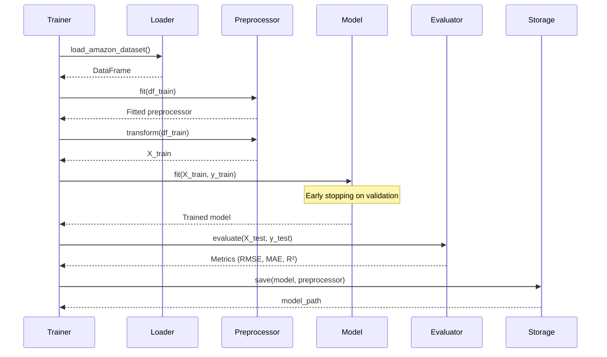
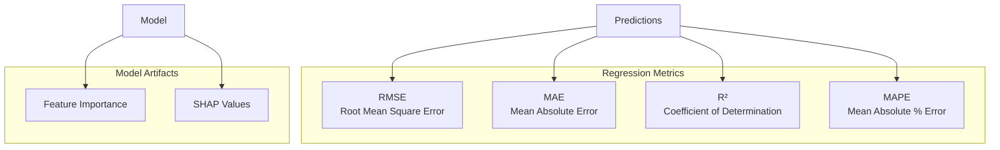
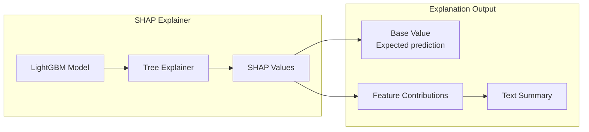
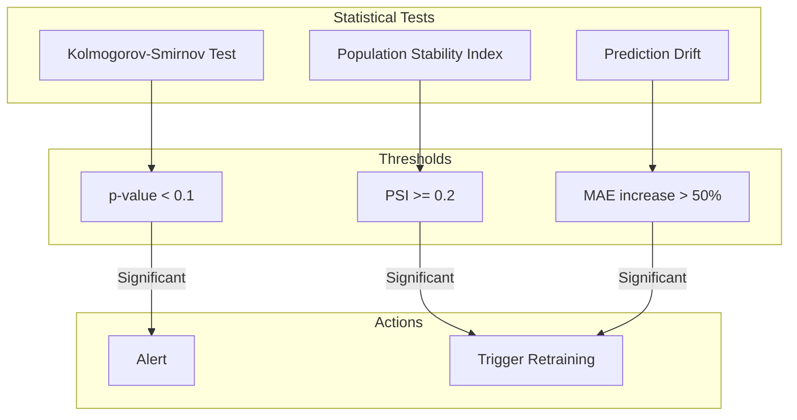
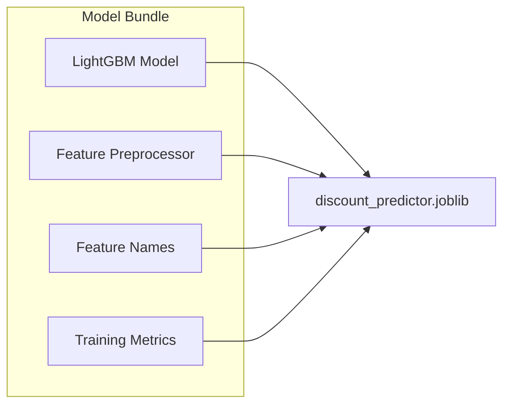
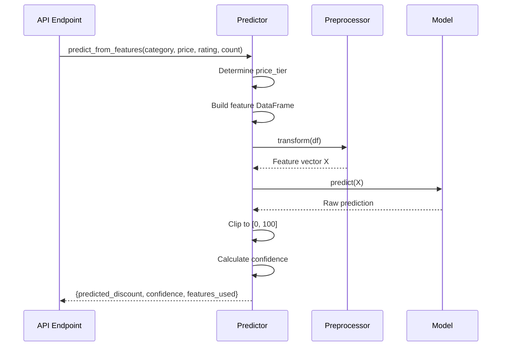

# Machine Learning Pipeline

This document details the ML pipeline architecture for discount prediction.

## Overview

The ML system uses LightGBM (Gradient Boosting) to predict optimal discount percentages for products based on historical sales data and product attributes.



## Feature Engineering

### Input Features



### Feature Descriptions

| Feature | Type | Description | Transformation |
|---------|------|-------------|----------------|
| `main_category` | Categorical | Top-level product category | Label Encoding |
| `sub_category` | Categorical | Sub-category | Label Encoding |
| `price_tier` | Categorical | Price bucket (budget/mid/premium/luxury) | Label Encoding |
| `actual_price` | Numerical | Original price | Standard Scaling |
| `rating` | Numerical | Product rating (1-5) | Standard Scaling |
| `rating_count` | Numerical | Number of reviews | Standard Scaling |
| `category_depth` | Numerical | Hierarchy depth | Standard Scaling |
| `name_length` | Numerical | Product name length | Standard Scaling |
| `description_length` | Numerical | Description length | Standard Scaling |
| `rating_count_log` | Numerical | Log-transformed rating count | Standard Scaling |
| `review_sentiment` | Numerical | Sentiment score (-1 to 1) | Standard Scaling |

## Model Architecture

### LightGBM Configuration

```python
params = {
    "objective": "regression",
    "metric": "rmse",
    "n_estimators": 100,
    "learning_rate": 0.1,
    "max_depth": 6,
    "num_leaves": 31,
    "min_child_samples": 20,
    "subsample": 0.8,
    "colsample_bytree": 0.8,
    "reg_alpha": 0.1,
    "reg_lambda": 0.1,
    "random_state": 42,
}
```

### Model Training Flow



## Model Evaluation

### Metrics Tracked



### Evaluation Metrics

| Metric | Formula | Interpretation |
|--------|---------|----------------|
| **RMSE** | √(Σ(y - ŷ)²/n) | Lower is better; same units as target |
| **MAE** | Σ\|y - ŷ\|/n | Average absolute error |
| **R²** | 1 - SS_res/SS_tot | 0-1; higher means better fit |
| **MAPE** | Σ\|y - ŷ\|/y * 100 | Percentage error |

## Explainability with SHAP

### SHAP Integration



### SHAP Explanation Structure

```json
{
    "base_value": 28.5,
    "prediction": 35.2,
    "shap_values": [
        {
            "feature_name": "category",
            "value": "Electronics",
            "shap_value": 4.2,
            "contribution": "positive"
        },
        {
            "feature_name": "rating_count",
            "value": 1250,
            "shap_value": 2.1,
            "contribution": "positive"
        }
    ],
    "explanation_summary": "The predicted discount is 35.2%..."
}
```

## Drift Detection

### Drift Detection Methods



### PSI Interpretation

| PSI Value | Interpretation |
|-----------|----------------|
| < 0.1 | No significant change |
| 0.1 - 0.2 | Slight change, monitor |
| ≥ 0.2 | Significant change, investigate |
| ≥ 0.25 | Major shift, retrain model |

## Model Persistence

### Saved Artifacts



### File Structure

```
models/
├── discount_predictor.joblib          # Current model
├── discount_predictor_20240115.joblib # Versioned backup
└── discount_predictor_20240110.joblib # Previous version
```

## Inference Pipeline

### Prediction Flow



### Confidence Calculation

Confidence is reduced based on:
- Extreme prices (< $10 or > $100,000): -20%
- Invalid ratings (< 1 or > 5): -30%
- Low rating count (< 5): -20%

Minimum confidence: 30%

## API Endpoints

| Endpoint | Method | Description |
|----------|--------|-------------|
| `/predict/discount` | POST | Make discount prediction |
| `/predict/status` | GET | Get model status |
| `/predict/train` | POST | Train/retrain model |
| `/predict/explain` | POST | Get SHAP explanation |

## Best Practices

### Model Training
1. Always validate on held-out test set
2. Use early stopping to prevent overfitting
3. Monitor feature importance for data quality
4. Version models with timestamps

### Production
1. Load model once at startup
2. Use singleton pattern for efficiency
3. Clip predictions to valid range
4. Return confidence scores

### Monitoring
1. Track prediction latency
2. Monitor prediction distribution
3. Set up drift detection alerts
4. Log all predictions for analysis

## Related Documentation

- [Data Flow](./data-flow.md) - Data processing details
- [API Documentation](../api/endpoints.md) - API reference
- [Deployment](../deployment/docker.md) - Deployment guide
