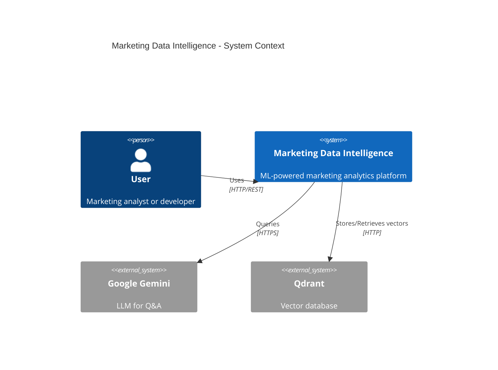
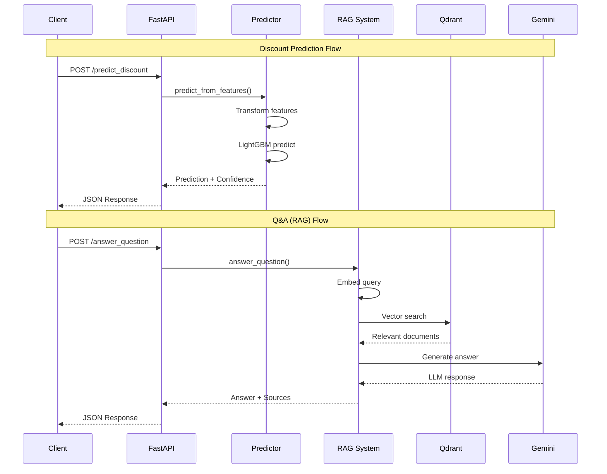
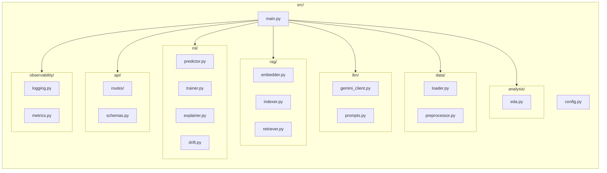

# Architecture Overview

This document provides a comprehensive overview of the Marketing Data Intelligence system architecture.

## System Architecture

The system is built as a modern, cloud-native application with microservices-ready architecture.

```mermaid
graph TB
    subgraph "Client Layer"
        Client[Client Applications]
        Docs[API Documentation]
    end
    
    subgraph "API Gateway Layer"
        FastAPI[FastAPI Application]
        CORS[CORS Middleware]
        Metrics[Metrics Middleware]
        Logging[Logging Middleware]
    end
    
    subgraph "API Routes"
        PredictRoute[/predict/*]
        QARoute[/qa/*]
        AnalysisRoute[/analysis/*]
        HealthRoute[/health]
    end
    
    subgraph "Core Services"
        Predictor[Discount Predictor<br/>LightGBM]
        RAG[RAG System]
        Analyzer[Data Analyzer]
    end
    
    subgraph "ML Components"
        Trainer[Model Trainer]
        Explainer[SHAP Explainer]
        DriftDetector[Drift Detector]
    end
    
    subgraph "RAG Components"
        Embedder[Text Embedder<br/>Sentence Transformers]
        Indexer[Document Indexer]
        Retriever[Document Retriever]
    end
    
    subgraph "LLM Layer"
        GeminiClient[Gemini Client]
        Prompts[Prompt Templates]
    end
    
    subgraph "Data Layer"
        DataLoader[Data Loader]
        Preprocessor[Feature Preprocessor]
    end
    
    subgraph "External Services"
        Qdrant[(Qdrant<br/>Vector DB)]
        GeminiAPI[Google Gemini API]
        FileSystem[(File System<br/>Models & Data)]
    end
    
    subgraph "Observability"
        Prometheus[Prometheus]
        Grafana[Grafana]
        StructLog[Structured Logging]
    end
    
    Client --> FastAPI
    Docs --> FastAPI
    FastAPI --> CORS --> Metrics --> Logging
    
    Logging --> PredictRoute
    Logging --> QARoute
    Logging --> AnalysisRoute
    Logging --> HealthRoute
    
    PredictRoute --> Predictor
    PredictRoute --> Explainer
    QARoute --> RAG
    AnalysisRoute --> Analyzer
    
    Predictor --> Trainer
    Predictor --> DriftDetector
    Trainer --> Preprocessor
    
    RAG --> Embedder
    RAG --> Retriever
    RAG --> GeminiClient
    
    Retriever --> Qdrant
    Indexer --> Qdrant
    Indexer --> Embedder
    GeminiClient --> GeminiAPI
    
    DataLoader --> FileSystem
    Predictor --> FileSystem
    
    FastAPI --> Prometheus
    Prometheus --> Grafana
    FastAPI --> StructLog
```

## High-Level Component Diagram



## Component Interaction Flow



## Technology Stack

| Layer | Technology | Purpose |
|-------|------------|---------|
| **API Framework** | FastAPI | High-performance async API |
| **ML Model** | LightGBM | Gradient boosting for prediction |
| **Vector DB** | Qdrant | Semantic search & retrieval |
| **Embeddings** | Sentence Transformers | Text to vector conversion |
| **LLM** | Google Gemini 2.0 Flash | Natural language generation |
| **Explainability** | SHAP | Model interpretability |
| **Monitoring** | Prometheus + Grafana | Metrics & visualization |
| **Logging** | structlog | Structured JSON logging |
| **Containerization** | Docker | Deployment consistency |

## Module Structure



## Design Principles

### 1. Separation of Concerns
Each module has a single responsibility:
- `ml/` - Machine learning operations
- `rag/` - Retrieval-augmented generation
- `llm/` - Language model integration
- `data/` - Data loading and preprocessing
- `api/` - HTTP interface

### 2. Singleton Pattern
Core services use singleton pattern for resource efficiency:
- `get_predictor()` - ML model instance
- `get_retriever()` - Vector DB client
- `get_gemini_client()` - LLM client
- `get_embedder()` - Embedding model

### 3. Configuration Management
- Environment-based configuration via Pydantic Settings
- `.env` file support for local development
- Type-safe configuration validation

### 4. Error Handling
- Global exception handler in FastAPI
- Structured error logging
- Graceful degradation (e.g., works without ML model)

### 5. Observability
- Prometheus metrics for all endpoints
- Structured JSON logging with request correlation
- Health checks for all dependencies

## Scalability Considerations


### Scaling Strategies

1. **API Layer**: Stateless design allows horizontal scaling
2. **Vector DB**: Qdrant supports clustering and sharding
3. **ML Model**: Model files can be stored in shared storage (S3, GCS)
4. **LLM**: Google Gemini API handles scaling automatically

## Security Considerations

1. **API Security**
   - CORS middleware configured
   - Input validation via Pydantic
   - Rate limiting (can be added)

2. **Secrets Management**
   - API keys via environment variables
   - No secrets in code

3. **Container Security**
   - Non-root user in Docker
   - Minimal base image

## Next Steps

- [ML Pipeline](./ml-pipeline.md) - Detailed ML architecture
- [RAG System](./rag-system.md) - RAG implementation details
- [Data Flow](./data-flow.md) - Data processing pipeline
