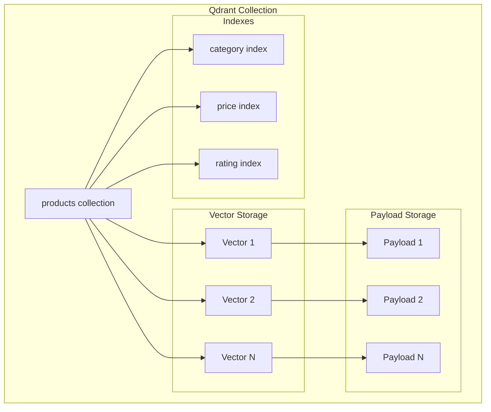

# RAG (Retrieval-Augmented Generation) System

This document details the RAG architecture for product Q&A functionality.

## Overview

The RAG system combines semantic search with LLM generation to answer product-related questions grounded in actual catalog data.


## System Components

### 1. Text Embedder


#### Configuration

| Parameter | Value | Description |
|-----------|-------|-------------|
| Model | `all-MiniLM-L6-v2` | Sentence Transformers model |
| Dimension | 384 | Embedding vector size |
| Normalization | L2 | Enables cosine similarity via dot product |
| Batch Size | 32 | Documents per batch |

### 2. Vector Database (Qdrant)



#### Collection Schema

```json
{
    "name": "products",
    "vectors_config": {
        "size": 384,
        "distance": "Cosine"
    },
    "payload_indexes": [
        {"field_name": "category", "type": "keyword"},
        {"field_name": "actual_price", "type": "float"},
        {"field_name": "rating", "type": "float"}
    ]
}
```

#### Document Payload

```json
{
    "text": "Product description...",
    "product_id": "PROD001",
    "product_name": "Sony WH-1000XM5",
    "category": "Electronics",
    "actual_price": 349.99,
    "discounted_price": 279.99,
    "discount_percentage": 20.0,
    "rating": 4.8,
    "rating_count": 12500
}
```

### 3. Document Indexer


### 4. Document Retriever


#### Search Parameters

| Parameter | Default | Description |
|-----------|---------|-------------|
| `top_k` | 5 | Number of results |
| `score_threshold` | 0.7 | Minimum similarity |
| `filter_category` | None | Category filter |
| `filter_min_price` | None | Minimum price |
| `filter_max_price` | None | Maximum price |
| `filter_min_rating` | None | Minimum rating |

### 5. LLM Client (Gemini)


#### Generation Configuration

```python
config = {
    "temperature": 0.7,
    "max_output_tokens": 1024,
    "top_p": 0.9,
    "top_k": 40,
    "system_instruction": SYSTEM_PROMPT
}
```

## RAG Workflow

### Complete Q&A Flow


### Context Building


#### Context Format

```
Relevant products from our catalog:

1. Sony WH-1000XM5
   Category: Electronics
   Price: $349.99
   Discount: 20.0%
   Rating: 4.8/5 (12500 reviews)
   Details: Premium noise-canceling wireless headphones...
   (Relevance: 92.5%)

2. Bose QuietComfort...
```

## Prompt Engineering

### System Prompt

```
You are an intelligent marketing assistant for an e-commerce platform.
Your role is to help users find products, answer questions about our 
catalog, and provide recommendations.

Guidelines:
1. Always base your answers on the provided product context
2. Be helpful, accurate, and concise
3. Never make up product information
4. Include relevant details like price, rating, discount
5. Format prices in a user-friendly way
```

### Q&A Prompt Template


### Few-Shot Examples

The system includes few-shot examples for:
- Product comparisons
- Deal/discount queries
- Recommendation requests

## Data Indexing Pipeline

### Document Preparation


### Document Text Structure

```python
text_parts = [
    f"Product: {product_name}",
    f"Category: {main_category}",
    f"Sub-category: {sub_category}",
    f"Description: {about_product[:800]}",
    f"Reviews: {review_content[:500]}",
]
document_text = "\n".join(text_parts)
```

## Filtering Capabilities

### Filter Types


### Filter Implementation

```python
filter_conditions = []

if filter_category:
    filter_conditions.append(
        FieldCondition(key="category", match=MatchValue(value=filter_category))
    )

if filter_max_price:
    filter_conditions.append(
        FieldCondition(key="actual_price", range=Range(lte=filter_max_price))
    )

query_filter = Filter(must=filter_conditions)
```

## Performance Optimization

### Embedding Caching


### Batch Processing

```python
# Index documents in batches
for i in range(0, len(documents), batch_size):
    batch = documents[i:i + batch_size]
    embeddings = embedder.embed_documents([d["text"] for d in batch])
    indexer.upsert(batch, embeddings)
```

## Error Handling

### Graceful Degradation


### Health Checks

```python
def health_check():
    return {
        "qdrant": retriever.health_check(),  # Collection exists?
        "gemini": gemini_client.health_check()  # API accessible?
    }
```

## API Endpoints

| Endpoint | Method | Description |
|----------|--------|-------------|
| `/qa/answer` | POST | Answer question with RAG |
| `/qa/answer/stream` | POST | Stream answer generation |
| `/qa/index` | POST | Index product data |
| `/qa/search` | GET | Semantic product search |
| `/qa/health` | GET | RAG system health |

## Monitoring

### Metrics

- `qa_requests_total` - Total Q&A requests
- `qa_latency_seconds` - Response time histogram
- `rag_results_count` - Number of retrieved results
- `grounded_responses` - % of grounded answers

## Best Practices

### Indexing
1. Re-index when data changes significantly
2. Use batch processing for large datasets
3. Include all searchable fields in text

### Retrieval
1. Tune `score_threshold` based on precision needs
2. Use filters to narrow search space
3. Return enough context (top_k=5-10)

### Generation
1. Include clear instructions in prompts
2. Use few-shot examples for consistency
3. Always cite sources in responses

## Related Documentation

- [Architecture Overview](./overview.md) - System architecture
- [ML Pipeline](./ml-pipeline.md) - ML model details
- [API Documentation](../api/endpoints.md) - API reference
