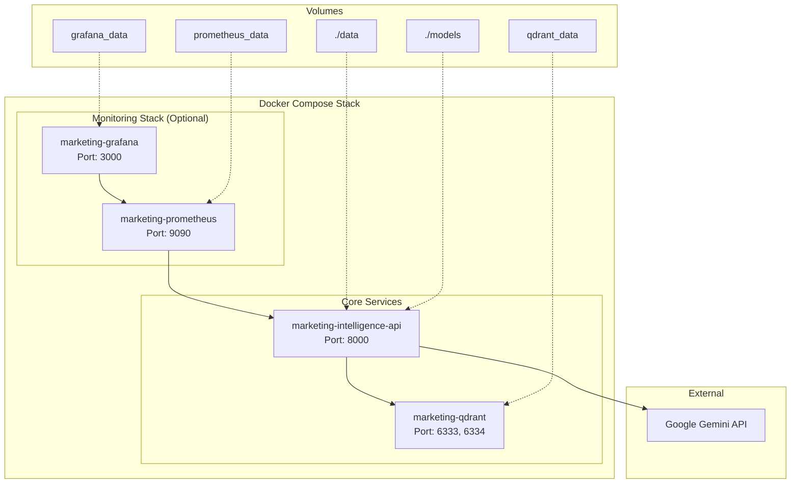
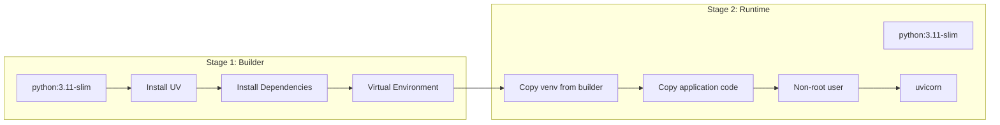
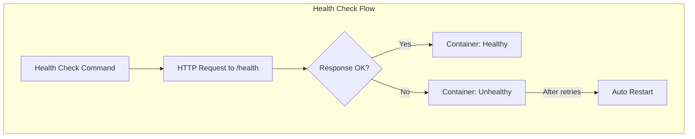

# Docker Deployment Guide

Complete guide for deploying Marketing Data Intelligence with Docker.

## Architecture



## Prerequisites

- Docker Engine 20.10+
- Docker Compose v2.0+
- 4GB+ RAM
- Google Gemini API key

## Quick Start

### 1. Clone and Configure

```bash
cd Marketing-Data-Intelligence

# Create environment file
cat > .env << EOF
GEMINI_API_KEY=your-api-key-here
APP_ENV=production
LOG_LEVEL=INFO
EOF
```

### 2. Start Services

```bash
# Start core services (app + Qdrant)
docker-compose up -d

# Start with monitoring
docker-compose --profile monitoring up -d
```

### 3. Initialize Data

```bash
# Wait for services to be ready
sleep 10

# Train the ML model
curl -X POST http://localhost:8000/predict/train \
  -H "Content-Type: application/json" \
  -d '{"use_sample_data": true}'

# Index data for RAG
curl -X POST http://localhost:8000/qa/index \
  -H "Content-Type: application/json" \
  -d '{"recreate_collection": true}'
```

### 4. Verify

```bash
# Check health
curl http://localhost:8000/health
```

## Docker Compose Configuration

### Services Overview

```yaml
services:
  app:           # FastAPI application
  qdrant:        # Vector database
  prometheus:    # Metrics (monitoring profile)
  grafana:       # Dashboards (monitoring profile)
```

### Environment Variables

| Variable | Description | Default |
|----------|-------------|---------|
| `GEMINI_API_KEY` | Google Gemini API key | Required |
| `APP_ENV` | Environment | production |
| `LOG_LEVEL` | Logging level | INFO |
| `API_PORT` | API port | 8000 |
| `QDRANT_PORT` | Qdrant port | 6333 |
| `PROMETHEUS_PORT` | Prometheus port | 9090 |
| `GRAFANA_PASSWORD` | Grafana admin password | admin |

### Volume Mounts

```yaml
volumes:
  - ./data:/app/data:ro       # Dataset (read-only)
  - ./models:/app/models      # ML models (read-write)
  - app_logs:/app/logs        # Application logs
```

## Dockerfile Details

### Multi-Stage Build



### Security Features

1. **Non-root user**: Application runs as `appuser`
2. **Minimal image**: Based on `python:3.11-slim`
3. **Read-only data**: Dataset mounted as read-only
4. **Health checks**: Built-in container health monitoring

### Build Arguments

```bash
# Build with custom options
docker build -t marketing-intelligence:custom .

# Build without cache
docker build --no-cache -t marketing-intelligence:fresh .
```

## Service Configuration

### Application Service

```yaml
app:
  build:
    context: .
    dockerfile: Dockerfile
  container_name: marketing-intelligence-api
  ports:
    - "${API_PORT:-8000}:8000"
  environment:
    - GEMINI_API_KEY=${GEMINI_API_KEY}
    - APP_ENV=${APP_ENV:-production}
    - LOG_LEVEL=${LOG_LEVEL:-INFO}
    - QDRANT_HOST=qdrant
    - QDRANT_PORT=6333
  volumes:
    - ./data:/app/data:ro
    - ./models:/app/models
  depends_on:
    qdrant:
      condition: service_healthy
  healthcheck:
    test: ["CMD", "python", "-c", "import httpx; httpx.get('http://localhost:8000/health').raise_for_status()"]
    interval: 30s
    timeout: 10s
    retries: 3
```

### Qdrant Service

```yaml
qdrant:
  image: qdrant/qdrant:latest
  container_name: marketing-qdrant
  ports:
    - "${QDRANT_PORT:-6333}:6333"
    - "6334:6334"  # gRPC
  volumes:
    - qdrant_data:/qdrant/storage
    - qdrant_snapshots:/qdrant/snapshots
  healthcheck:
    test: ["CMD", "curl", "-f", "http://localhost:6333/healthz"]
    interval: 10s
    timeout: 5s
    retries: 5
```

## Deployment Commands

### Basic Operations

```bash
# Start services
docker-compose up -d

# Stop services
docker-compose down

# View logs
docker-compose logs -f app

# Restart service
docker-compose restart app

# Rebuild and start
docker-compose up -d --build
```

### Monitoring Profile

```bash
# Start with monitoring
docker-compose --profile monitoring up -d

# Access monitoring
# Prometheus: http://localhost:9090
# Grafana: http://localhost:3000 (admin/admin)
```

### Scaling (Future)

```bash
# Scale API instances (with load balancer)
docker-compose up -d --scale app=3
```

## Health Checks

### Container Health



### Manual Health Check

```bash
# Check container status
docker-compose ps

# Check application health
curl http://localhost:8000/health

# Check Qdrant health
curl http://localhost:6333/healthz
```

## Networking

### Default Network

```yaml
networks:
  marketing-net:
    driver: bridge
```

### Service Discovery

| Service | Internal Hostname | Ports |
|---------|-------------------|-------|
| App | `app` | 8000 |
| Qdrant | `qdrant` | 6333, 6334 |
| Prometheus | `prometheus` | 9090 |
| Grafana | `grafana` | 3000 |

## Data Persistence

### Volumes

```yaml
volumes:
  qdrant_data:
    name: marketing_qdrant_data
  qdrant_snapshots:
    name: marketing_qdrant_snapshots
  prometheus_data:
    name: marketing_prometheus_data
  grafana_data:
    name: marketing_grafana_data
  app_logs:
    name: marketing_app_logs
```

### Backup and Restore

```bash
# Backup Qdrant data
docker run --rm -v marketing_qdrant_data:/data -v $(pwd):/backup \
  alpine tar czf /backup/qdrant_backup.tar.gz /data

# Restore Qdrant data
docker run --rm -v marketing_qdrant_data:/data -v $(pwd):/backup \
  alpine tar xzf /backup/qdrant_backup.tar.gz -C /

# Backup models
cp -r models/ models_backup/
```

## Production Considerations

### Security Checklist

- [ ] Set strong `GRAFANA_PASSWORD`
- [ ] Configure CORS for production domains
- [ ] Enable TLS/HTTPS (via reverse proxy)
- [ ] Set up API rate limiting
- [ ] Review network policies

### Performance Tuning

```yaml
# Resource limits
services:
  app:
    deploy:
      resources:
        limits:
          cpus: '2'
          memory: 4G
        reservations:
          cpus: '1'
          memory: 2G
```

### Logging

```bash
# Configure log rotation
docker-compose logs --tail=100 app

# Export logs
docker-compose logs app > app.log
```

## Troubleshooting

### Common Issues

| Issue | Solution |
|-------|----------|
| Port already in use | Change port in `.env` |
| Qdrant connection refused | Wait for Qdrant to be healthy |
| Model not found | Run training endpoint |
| Out of memory | Increase Docker memory limit |

### Debug Commands

```bash
# Check container logs
docker-compose logs -f app

# Enter container shell
docker-compose exec app bash

# Check network
docker network inspect marketing-net

# Resource usage
docker stats
```

### Reset Everything

```bash
# Stop and remove all
docker-compose down -v

# Remove images
docker-compose down --rmi all

# Clean start
docker-compose up -d --build
```

## CI/CD Integration

### GitHub Actions Example

```yaml
name: Deploy

on:
  push:
    branches: [main]

jobs:
  deploy:
    runs-on: ubuntu-latest
    steps:
      - uses: actions/checkout@v4
      
      - name: Build and push
        run: |
          docker build -t marketing-intelligence:${{ github.sha }} .
          docker push registry/marketing-intelligence:${{ github.sha }}
      
      - name: Deploy
        run: |
          docker-compose pull
          docker-compose up -d
```

## Related Documentation

- [Architecture Overview](../architecture/overview.md)
- [Monitoring Guide](./monitoring.md)
- [Development Setup](../development/setup.md)
