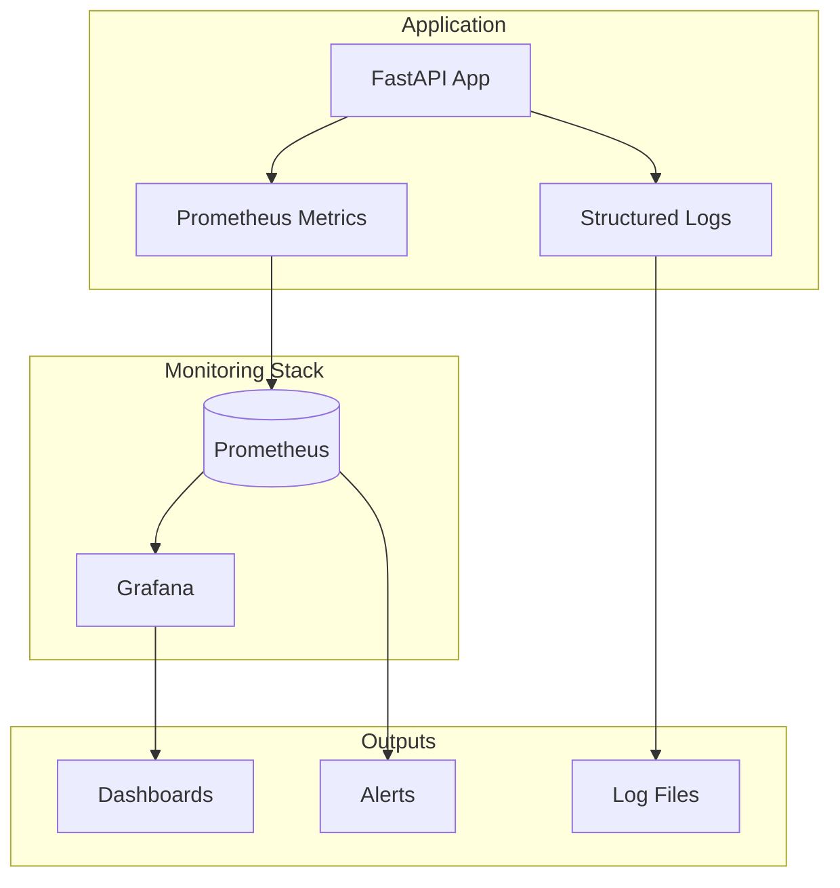
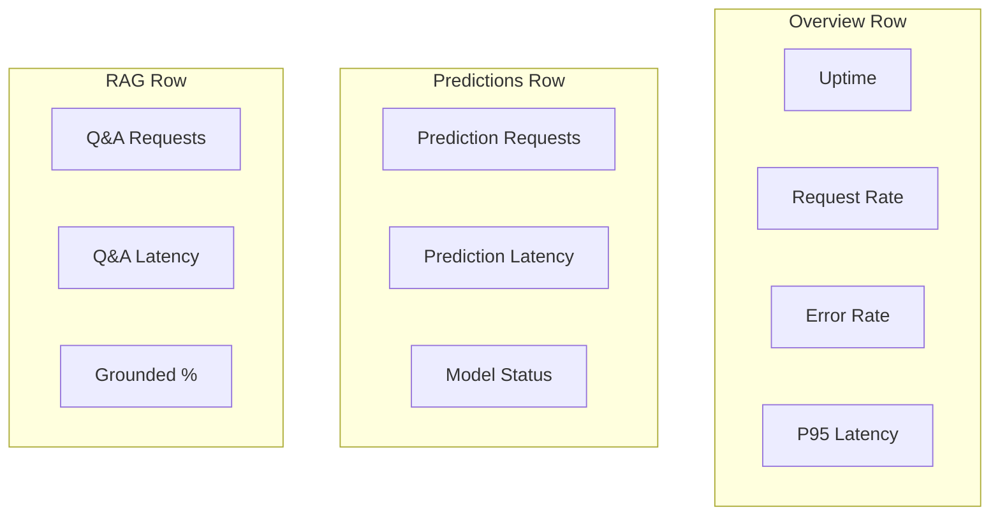
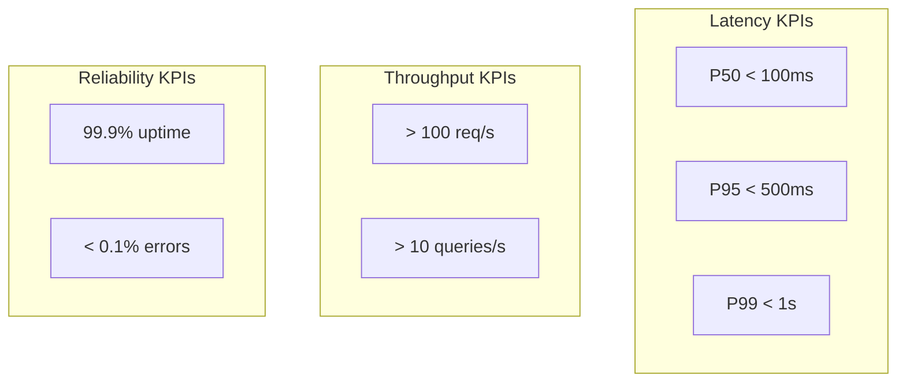

# Monitoring Guide

Complete guide for monitoring the Marketing Data Intelligence system.

## Overview



## Prometheus Metrics

### Available Metrics

#### HTTP Metrics

| Metric | Type | Labels | Description |
|--------|------|--------|-------------|
| `http_requests_total` | Counter | method, endpoint, status | Total HTTP requests |
| `http_request_duration_seconds` | Histogram | method, endpoint | Request latency |

#### Prediction Metrics

| Metric | Type | Labels | Description |
|--------|------|--------|-------------|
| `prediction_requests_total` | Counter | category | Prediction requests |
| `prediction_latency_seconds` | Histogram | - | Prediction latency |
| `model_loaded` | Gauge | - | ML model status |

#### RAG Metrics

| Metric | Type | Labels | Description |
|--------|------|--------|-------------|
| `qa_requests_total` | Counter | grounded | Q&A requests |
| `qa_latency_seconds` | Histogram | - | Q&A latency |
| `rag_results_count` | Histogram | - | Retrieved results per query |

### Accessing Metrics

```bash
# Raw metrics
curl http://localhost:8000/metrics

# Sample output
# HELP http_requests_total Total HTTP requests
# TYPE http_requests_total counter
http_requests_total{method="POST",endpoint="/predict_discount",status="200"} 150
http_requests_total{method="POST",endpoint="/answer_question",status="200"} 75
```

## Prometheus Configuration

### prometheus.yml

```yaml
global:
  scrape_interval: 15s
  evaluation_interval: 15s

scrape_configs:
  - job_name: 'marketing-intelligence'
    static_configs:
      - targets: ['app:8000']
    metrics_path: /metrics
```

### Starting Prometheus

```bash
# With Docker Compose
docker-compose --profile monitoring up -d prometheus

# Access UI
open http://localhost:9090
```

### Useful PromQL Queries

```promql
# Request rate (requests/second)
rate(http_requests_total[5m])

# 95th percentile latency
histogram_quantile(0.95, rate(http_request_duration_seconds_bucket[5m]))

# Error rate
rate(http_requests_total{status=~"5.."}[5m]) / rate(http_requests_total[5m])

# Prediction success rate
rate(prediction_requests_total[5m])

# Average RAG results
rate(rag_results_count_sum[5m]) / rate(rag_results_count_count[5m])
```

## Grafana Dashboards

### Setup

```bash
# Start Grafana
docker-compose --profile monitoring up -d grafana

# Access (admin/admin)
open http://localhost:3000
```

### Pre-configured Dashboard

The `monitoring/grafana/provisioning/dashboards/` directory contains pre-configured dashboards.

### Dashboard Panels



### Custom Panel: Request Rate

```json
{
  "title": "Request Rate",
  "type": "stat",
  "targets": [
    {
      "expr": "sum(rate(http_requests_total[5m]))",
      "legendFormat": "req/s"
    }
  ]
}
```

### Custom Panel: Latency Histogram

```json
{
  "title": "Response Time Distribution",
  "type": "heatmap",
  "targets": [
    {
      "expr": "rate(http_request_duration_seconds_bucket[5m])"
    }
  ]
}
```

## Structured Logging

### Log Format

```json
{
  "event": "request_completed",
  "timestamp": "2024-01-15T10:30:45.123456Z",
  "logger": "src.main",
  "level": "info",
  "request_id": "abc123",
  "method": "POST",
  "path": "/predict_discount",
  "status_code": 200
}
```

### Log Events

| Event | Level | Description |
|-------|-------|-------------|
| `application_starting` | info | App startup |
| `request_started` | info | Request received |
| `request_completed` | info | Request finished |
| `prediction_error` | error | Prediction failed |
| `generation_error` | error | LLM error |
| `drift_detected` | warning | Model drift |

### Viewing Logs

```bash
# Docker logs
docker-compose logs -f app

# Filter by level
docker-compose logs app 2>&1 | grep '"level":"error"'

# JSON parsing with jq
docker-compose logs app 2>&1 | jq 'select(.level == "error")'
```

## Health Monitoring

### Health Endpoints

```mermaid
graph LR
    Health[/health] --> ML{ML Model}
    Health --> Qdrant{Qdrant}
    Health --> Gemini{Gemini}
    
    ML -->|loaded| OK1[healthy]
    ML -->|not loaded| WARN1[degraded]
    
    Qdrant -->|connected| OK2[healthy]
    Qdrant -->|error| ERR2[unhealthy]
    
    Gemini -->|configured| OK3[healthy]
    Gemini -->|error| ERR3[unhealthy]
```

### Health Check Script

```bash
#!/bin/bash
# health_check.sh

HEALTH=$(curl -s http://localhost:8000/health)
STATUS=$(echo $HEALTH | jq -r '.status')

if [ "$STATUS" != "healthy" ]; then
    echo "ALERT: System status is $STATUS"
    echo $HEALTH | jq .
    exit 1
fi

echo "System healthy"
```

## Alerting

### Prometheus Alerting Rules

```yaml
# alerts.yml
groups:
  - name: marketing-intelligence
    rules:
      - alert: HighErrorRate
        expr: rate(http_requests_total{status=~"5.."}[5m]) > 0.1
        for: 5m
        labels:
          severity: critical
        annotations:
          summary: "High error rate detected"
          
      - alert: SlowResponses
        expr: histogram_quantile(0.95, rate(http_request_duration_seconds_bucket[5m])) > 2
        for: 5m
        labels:
          severity: warning
        annotations:
          summary: "95th percentile latency above 2s"
          
      - alert: ModelNotLoaded
        expr: model_loaded == 0
        for: 1m
        labels:
          severity: warning
        annotations:
          summary: "ML model not loaded"
```

### Grafana Alerts

1. Go to Dashboard → Panel → Edit → Alert
2. Configure conditions:
   - Query: `rate(http_requests_total{status="500"}[5m]) > 0`
   - Condition: "IS ABOVE 0"
3. Configure notifications (email, Slack, etc.)

## Performance Monitoring

### Key Performance Indicators



### Latency Breakdown

```promql
# By endpoint
histogram_quantile(0.95, 
  sum(rate(http_request_duration_seconds_bucket[5m])) by (endpoint, le)
)

# Prediction vs Q&A
histogram_quantile(0.95, 
  sum(rate(http_request_duration_seconds_bucket{endpoint=~"/predict.*"}[5m])) by (le)
)
```

## Resource Monitoring

### Docker Stats

```bash
# Real-time stats
docker stats marketing-intelligence-api marketing-qdrant

# Output
CONTAINER ID   NAME                        CPU %   MEM USAGE / LIMIT
abc123         marketing-intelligence-api  2.5%    512MiB / 4GiB
def456         marketing-qdrant            1.2%    256MiB / 2GiB
```

### cAdvisor Integration

```yaml
# Add to docker-compose.yml
cadvisor:
  image: gcr.io/cadvisor/cadvisor:latest
  volumes:
    - /:/rootfs:ro
    - /var/run:/var/run:ro
    - /sys:/sys:ro
    - /var/lib/docker/:/var/lib/docker:ro
  ports:
    - "8080:8080"
```

## Log Aggregation

### ELK Stack Integration

```yaml
# Filebeat configuration
filebeat.inputs:
  - type: container
    paths:
      - '/var/lib/docker/containers/*/*.log'
    processors:
      - add_docker_metadata:
          host: "unix:///var/run/docker.sock"

output.elasticsearch:
  hosts: ["elasticsearch:9200"]
```

### Loki + Promtail

```yaml
# promtail-config.yml
server:
  http_listen_port: 9080

positions:
  filename: /tmp/positions.yaml

clients:
  - url: http://loki:3100/loki/api/v1/push

scrape_configs:
  - job_name: containers
    static_configs:
      - targets:
          - localhost
        labels:
          job: containerlogs
          __path__: /var/lib/docker/containers/*/*.log
```

## Dashboard Examples

### System Overview Dashboard

```
┌─────────────────┬─────────────────┬─────────────────┐
│    Uptime       │  Request Rate   │   Error Rate    │
│     99.9%       │    45 req/s     │     0.02%       │
├─────────────────┴─────────────────┴─────────────────┤
│                  Latency Over Time                   │
│  [Graph showing P50, P95, P99 over time]            │
├─────────────────┬─────────────────┬─────────────────┤
│ Predictions/min │   Q&A/min       │  Grounded %     │
│       120       │       45        │     85%         │
├─────────────────┴─────────────────┴─────────────────┤
│                  Request Distribution                │
│  [Heatmap by endpoint and time]                     │
└─────────────────────────────────────────────────────┘
```

## Runbook

### High Error Rate

1. Check logs: `docker-compose logs app | grep error`
2. Check health: `curl http://localhost:8000/health`
3. Check resources: `docker stats`
4. Restart if needed: `docker-compose restart app`

### Slow Responses

1. Check query complexity
2. Check Qdrant load: `curl http://localhost:6333/metrics`
3. Check model size and memory
4. Consider horizontal scaling

### Model Drift Detected

1. Review drift metrics
2. Collect recent data sample
3. Trigger retraining: `POST /predict/train`
4. Validate new model

## Related Documentation

- [Docker Deployment](./docker.md)
- [Architecture Overview](../architecture/overview.md)
- [API Reference](../api/endpoints.md)
